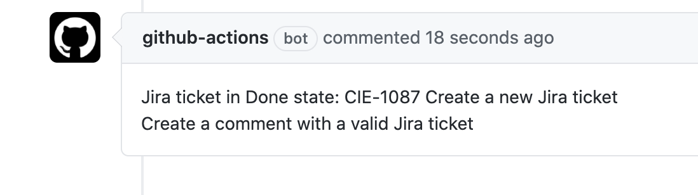
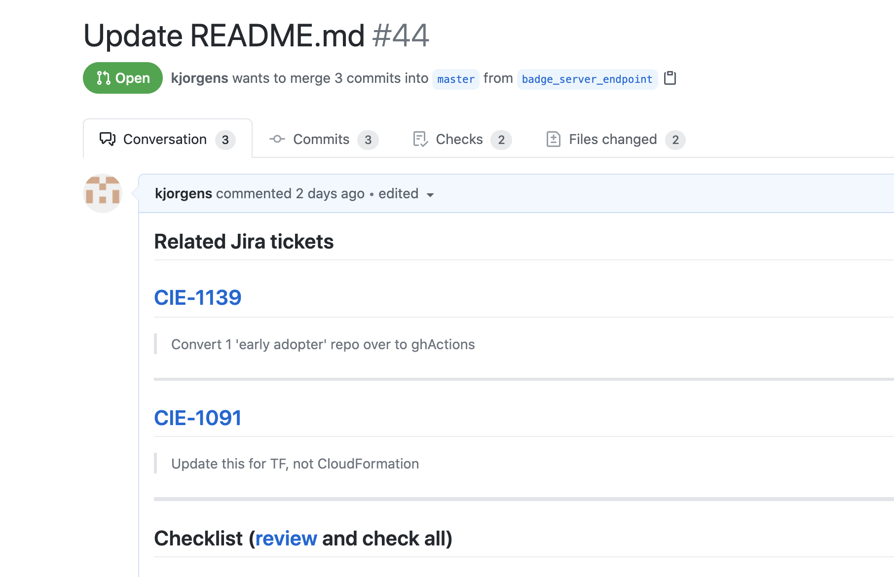
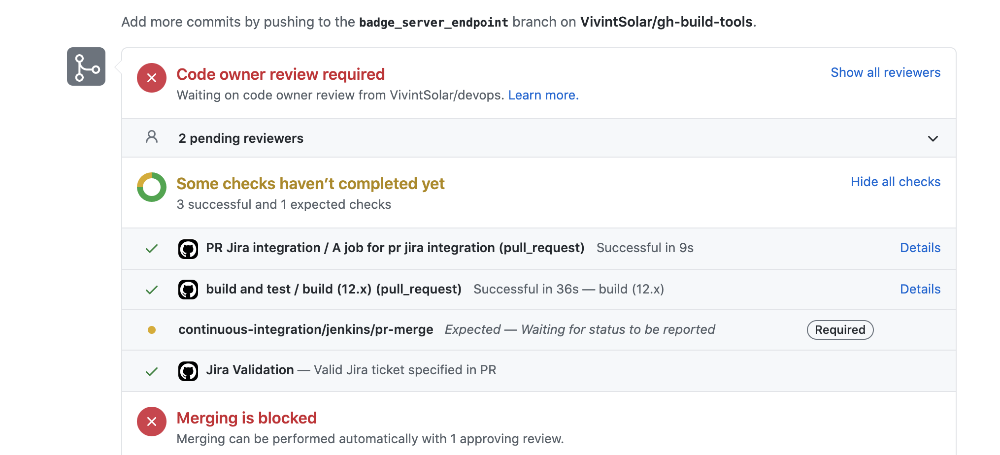
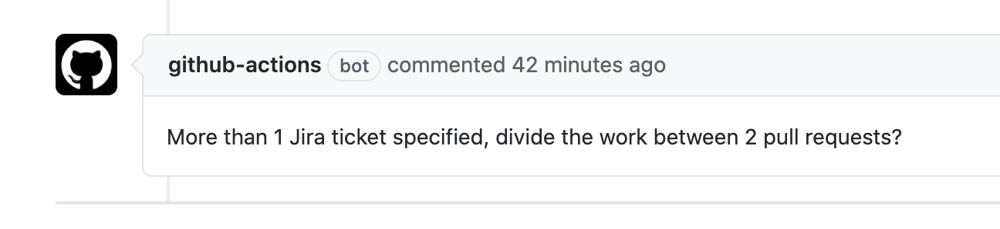

# Github pr/jira action

This action integrates Jira with Github pull requests.

## About

GitHub Action to integrate Jira tickets with GitHub pull requests. Checks pull request for valid Jira tickets. If a ticket does not exist or is done or closed, a comment is created on the pull request.

Listens for pull request comments that contain a Jira ticket. Adds link and Jira ticket description to the pull request body.

Sets GitHub status to indicate specified Jira tickets are valid.

If more than one Jira ticket is specified, a reminder comment is created.


---

## Usage (inputs) [actions.yml](action.yml)
 _repo-owner:_

    GitHub organization name   
 _github_token:_

    secrets.GITHUB_TOKEN or a GitHub personal access token.
 _jira-required-status:_

    GitHub pull request status context for Jira.
    default: Jira Validation
 _jira-host:_

    https://<yourjira>.jira.com
 _jira-user:_

    Jira API user email
 _jira-api-token:_

    Jira API token
 _ticket-search-branch:_

    Search for tickets in PR branch name
 _ticket-search-title:_

    Search for tickets in PR title
 _ticket-search-pr-body:_

    Search for tickets in PR body
 _ticket-search-comments:_

    Search for tickets in PR comments
    
 


```yaml
name: PR Jira integration

on:
  issue_comment:
    types: [created]
  pull_request:
    types: [opened, synchronize, reopened]

jobs:
  jira_ticket_job:
    runs-on: ubuntu-latest
    name: A job to integrate jira with github
    steps:
      # To use this repository's private action, you must check out the repository
      - name: Checkout
        uses: actions/checkout@v2
      - name: pr jira validation
        uses: kjorgens/pr-jira-action@main
        id: prJira
        with:
          jira-endpoint: https://<your jira org>.jira.com
          repo-owner: orgname
          github-token: ${{ secrets.GITHUB_TOKEN }}
          jira-user: ${{ secrets.JIRA_USER }}
          jira-api-token: ${{ secrets.JIRA_API_TOKEN }}
          jira-required-status: Jira Validation
          ticket-search-branch: true
          ticket-search-title: true
          ticket-search-pr-body: false
          ticket-search-comments: false
```
